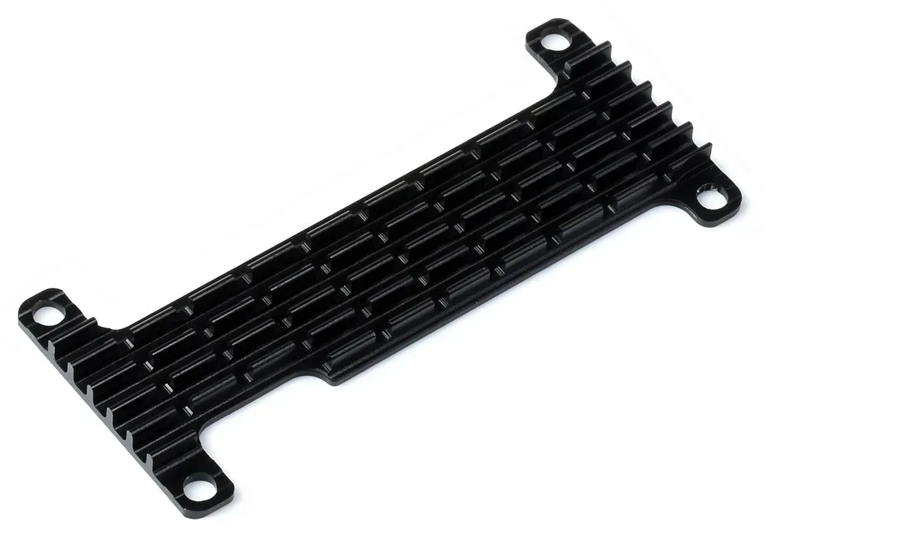
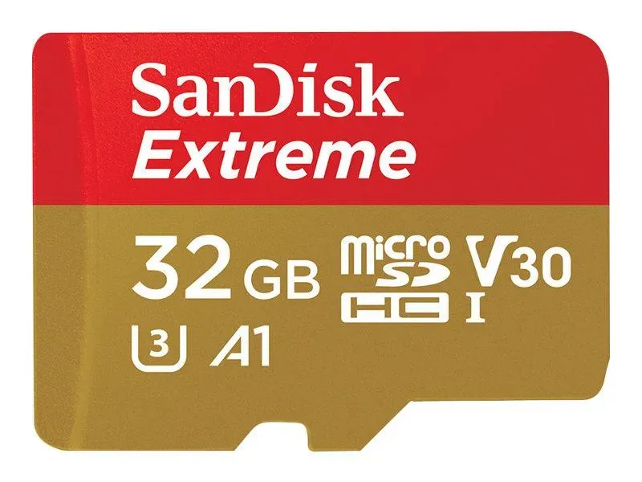
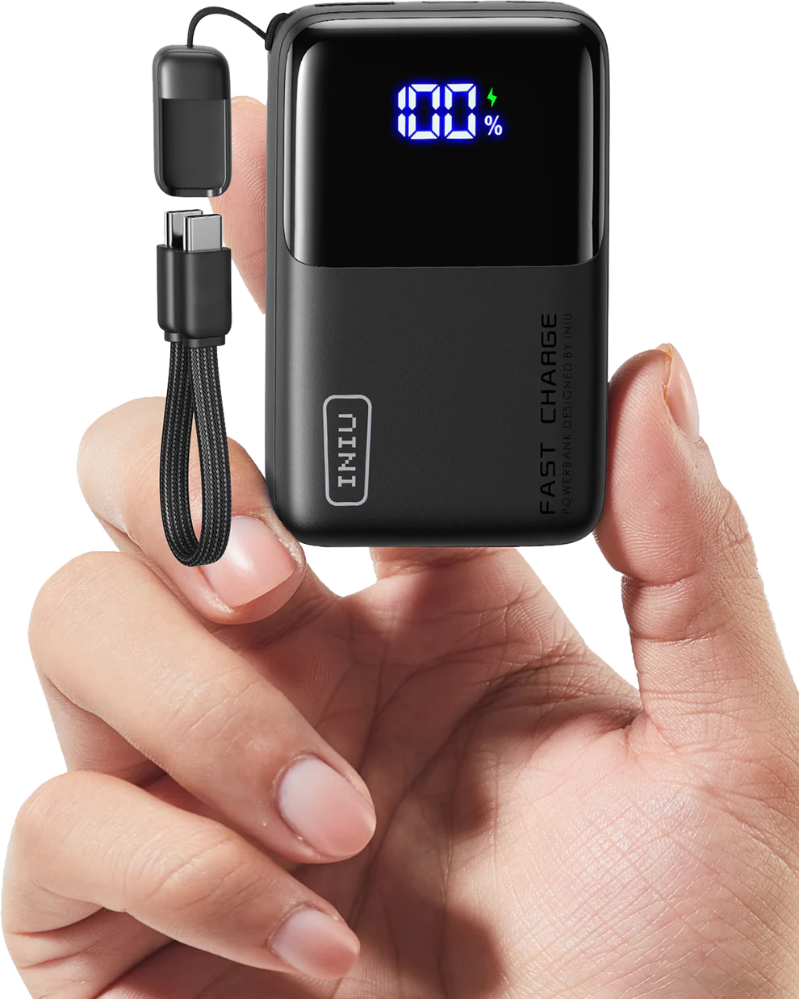
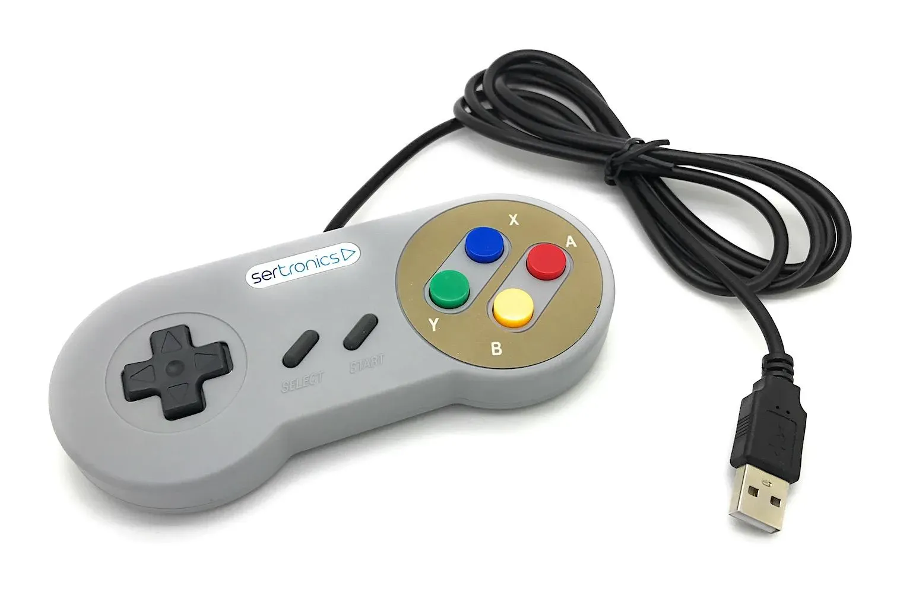
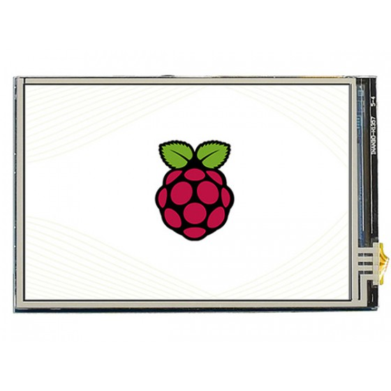

# About NikaBoy

- current version: v0.6

- Open Source Project for an emulation device. A Project i came up myself and was suprised when i saw that a company even sold something like this way back(They are off the market).

- NikaBoy is a Project that emulates various games from GameBoy.
It can also emulate different Games with the right SBC.

## Supported Consoles

- GameBoy
- GameBoy Color
- GameBoy Advance
- Nitendo Entertaiment System
- Super Nitendo Entertaiment System
- Master System
- Game Gear
- PC Engine
- Atari 2600/5200
- Commotore 64
- Neo Game

  ## License

This project is licensed under the [Creative Commons Attribution-Share Alike 4.0](https://creativecommons.org/licenses/by-sa/4.0/) license.

# Before Hand

- This is currently only a Prototype and it can end in bad results. i will upload eiather a "How to..." tutorial or some follow pictures.

# Hardware

- Case: [3D Printed with ASA](https://cad.onshape.com/documents/dd91bae101324d5c429ef6cf/w/cb18bab8c2ce562646a1ddd5/e/844543bad99d799db881c0ff) or Direct download here [3D Models](Hardware/3D%20Models/)
  
  

- SBC: [Raspberry Zero 2 W](https://www.berrybase.de/raspberry-pi-zero-2-w)

- Cooling: [Passiv Cooler from Waveshare](https://www.berrybase.de/waveshare-aluminiumkuehlkoerper-fuer-raspberry-pi-zero-zero-2-w)

  

- SD Car: [SanDisk 32Gb](https://www.berrybase.de/sandisk-ultra-microsdhc-a1-120mb-s-class-10-speicherkarte-adapter-32gb)

  

- Powerbank: [INU Rocket Pocket(P50-E1)](https://eu-main.iniushop.com/de/products/new-colorful-iniu-carry-p50-e1-power-bank-45w-smallest-10000mah)

  

- Controller: [SNES Controller](https://www.berrybase.de/usb-2.0-controller-im-snes-design-grau)

  
  
- Screen: [3.5 inch/Zoll LCD from Waveshare](https://www.waveshare.com/product/3.5inch-hdmi-lcd.htm)

  
  

# Software

- Since i used Batocera on a PC before i will use it on this too.

# **DISCLAIMER**

- This project **contains** information and instructions for opening power banks and related devices. 

**Please note:**
- This project is for **educational purposes only**
- Opening devices may **void warranties**
- Improper handling can cause **injury or damage**
- Always follow **safety precautions** when working with batteries and electronics
- I am **not responsible** for any damage, injury, or loss resulting from the use of this information
- Check local laws and regulations before disassembling any devices

- You are free to use other Hardware and Software for this Project if you want. My current subtotal is 120€

**Use at your own risk.**
